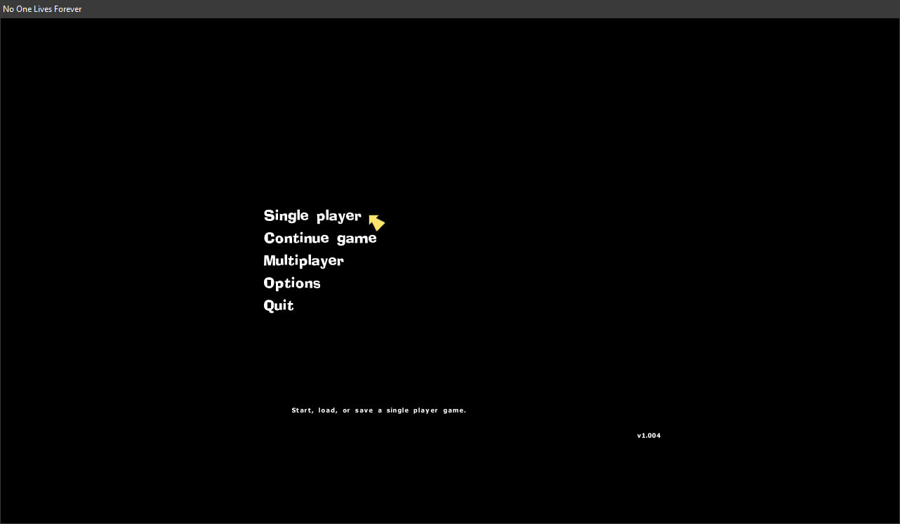

# Direct 3D (7.0) EX Renderer

This is a test proxy DLL that extends the d3d.ren for No One Lives Forever.

You can use LTRen.h as a base for your own renderer, however the renderer (particularly the 3d section) hasn't been fully reversed engineered yet.

## State

Currently it doesn't really work. I used it to test to see if this could fix the extremely slow text rendering in NOLF. I threw in the BlitToScreen function from OpenRen (Which is just a SDL2 blit) as well as some hastily wrote functions to get stuff on the screen. And it seems to be just as slow. (Which is odd because it's fast in OpenRen!)

